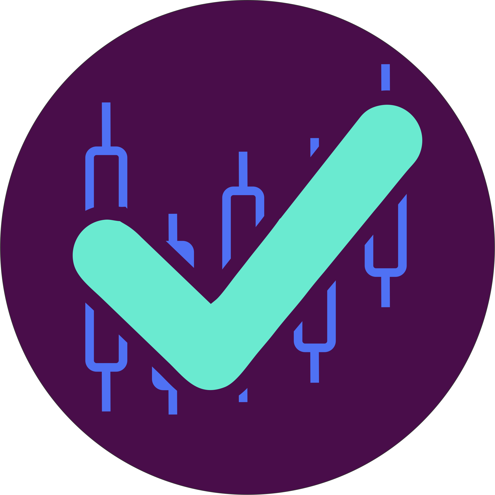

  

<h1 align="center">Hello World, I'm Douglas 👋</h1>

  <i>Tech Leader @ <b><a href="https://higlobe.com/">Higlobe</b></a></i>

  <i>Campina Grande, Brazil</i>

  
  

### Personal projects
<a href="https://www.recognitions.app/">

#### KudosApp
A Slack app to help on teammates recognition

</a>

<a href="https://alvio-app.herokuapp.com/">

#### Alvio
Find the next target of your investment

</a>

### Open source contributions
<a href="https://www.manageiq.org/">

#### ManageIQ
Discover, Optimize, and Control your Hybrid IT

</a>

<a href="https://github.com/reactjs/pt-BR.reactjs.org/">

#### React
PT-BR documentation

</a>

